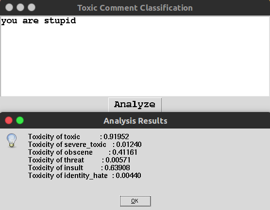

# README
## Quick Start

### Version 3

- **python toxic_comment_classification_CNN_GRU_Glove.py**：生成文本预处理文件.pkl，模型框架文件.json和模型文件.h5。个人i5电脑预计计算1.5h。

- **python app.py**: 生成tkinter交互程序，如下（显示老是对不齐，但是shell输出是正常的）：

- **python toxic_comment_classification_CNN_GRU_Glove_predict.py**： 生成shell交互程序

  

## 版本

### Version 3

- 新增用户交互，自定义文本功能。新增程序文件见：

  toxic_comment_classification_CNN_GRU_Glove.py

  toxic_comment_classification_CNN_GRU_Glove_predict.py

  app.py

#### Version 2

- 新增LSTM_fasttext模型和LR模型，以及模型融合算法。

- 修改训练集数据比例，切分方式改为0.95:0.05.

- 融合模型提交至kaggle上得分为：0.9851

  
#### Version 1
- 首次提交

## 报告及代码

- capstone_report.pdf
- toxic_comment_classification_CNN_GRU_Glove.ipynb
- toxic_comment_classification_LSTM_fasttext.ipynb
- toxic_comment_classification_tf-idf_nblr.ipynb
- 模型融合：blend_model.py

## 开发工具
- ubuntu 16.4、 jupyter notebook
- python3、numpy、pandas、 nltk、 keras
- AWS GPU

## 链接
- udacity项目地址：https://github.com/udacity/cn-machine-learning
- fasttext词向量地址：https://fasttext.cc/docs/en/english-vectors.html
- glove词向量地址：https://nlp.stanford.edu/projects/glove/

## 参考

部分参考如下，一些相关资料见NOTE.md

[1]. https://www.kaggle.com/c/jigsaw-toxic-comment-classification-challenge#description

[2]. https://blog.csdn.net/Heloiselt/article/details/80870794

[3]. XinRong, word2vec Parameter Learning Explained, 2016.

[4]. http://wiki.jikexueyuan.com/project/deep-learning/word-vector.html

[5]. https://jizhi.im/blog/post/understanding-convolutional-neural-networks-for-nlp

[6]. https://www.kaggle.com/tunguz/logistic-regression-with-words-and-char-n-grams

[7]. https://www.kaggle.com/yekenot/textcnn-2d-convolution

[8]. https://en.wikipedia.org/wiki/Receiver_operating_characteristic

[9]. https://keras-cn.readthedocs.io/en/latest/layers

[10]. https://zhuanlan.zhihu.com/p/28087321

[11]. https://machinelearningmastery.com/prepare-text-data-deep-learning-keras/